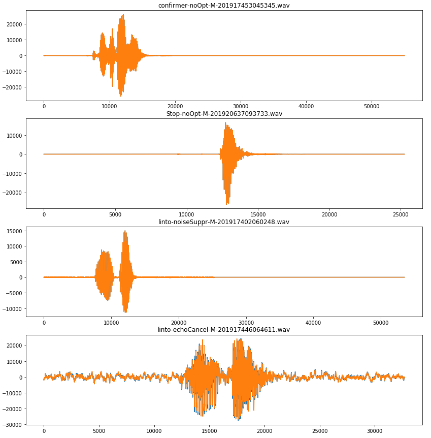
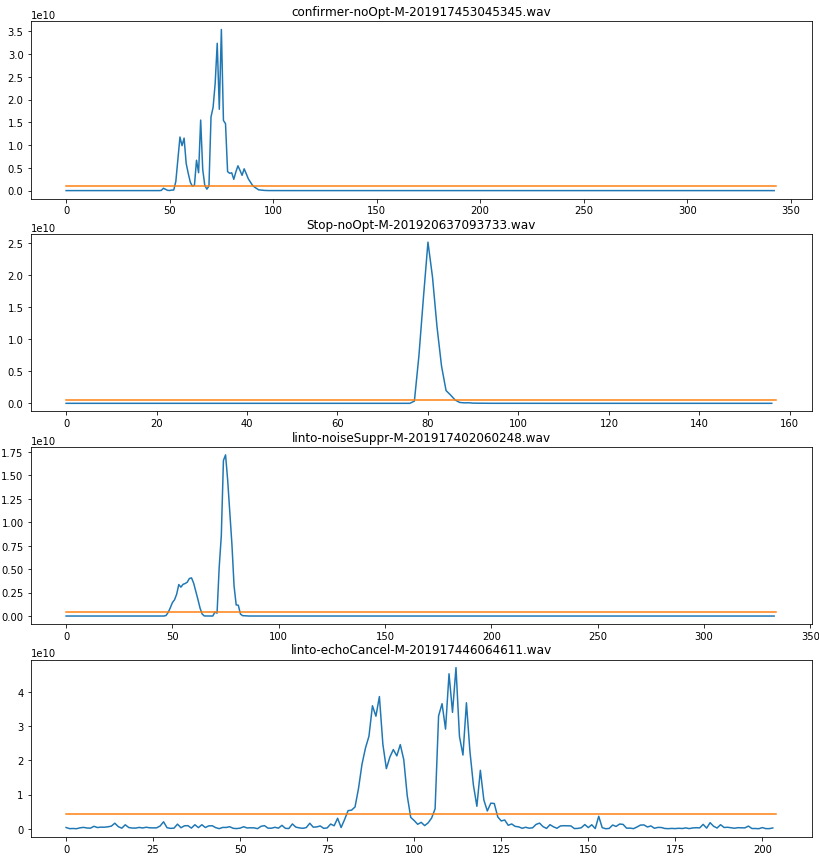
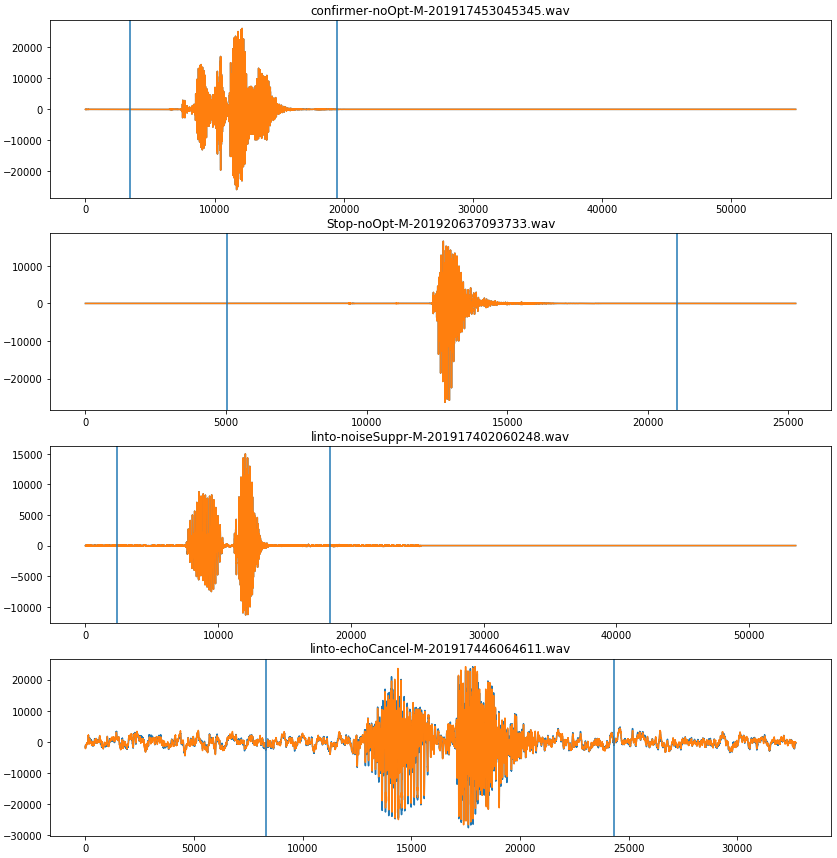

# Sample Split

## Introduction

This standalone script is used to normalize speech samples to a given samplerate and duration.
It was designed to process batch of recorded keywords.

## How it works

Its uses energy to determine the speech segment and return a window centered on that segment.

First the audio files are loaded and resampled (facultative):



Then energy and mean energy is processed:



Finally, the resulting window is set around the speech segment:



When the script fail to determine a proper window the concerned files are specified in a troublesome.txt file in the output directory.

## Usage

### Installation

The script uses [librosa](https://librosa.github.io/librosa/) for resampling, [wavio](https://github.com/WarrenWeckesser/wavio) to write result file and [numpy](https://github.com/numpy/numpy) for the processing.

```python
pip install librosa wavio numpy
```

### Uses

```bash
usage: trimmer.py [-h] [--window_length WINDOW_LENGTH] [--resample RESAMPLE]
                  source_folder destination_folder duration

Sample split is designed to process a batch a wav files by trimming them to a
specified duration.

positional arguments:
  source_folder         Source folder containing wav files
  destination_folder    Destintion folder where trimmed file will be written
  duration              Desired duration

optional arguments:
  -h, --help            show this help message and exit
  --window_length WINDOW_LENGTH
                        Analysis window length in second
  --resample RESAMPLE   Resample file to given sample rate prior to trimming
```
